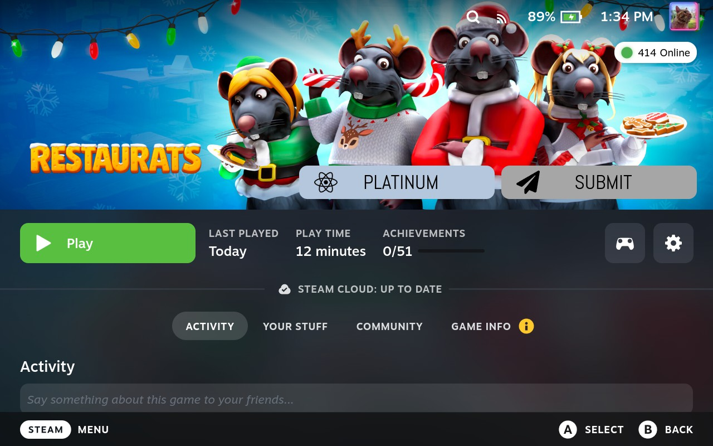

# ProtonDB Badges for Steam Deck

A personal maintained build of the ProtonDB Decky plugin, updated for newer Steam Deck and SteamOS UI behavior.

This plugin adds a ProtonDB badge to Steam game pages and links it to the ProtonDB page for that game.



## What changed

This build keeps the original functionality while adding compatibility fixes for newer Decky Loader and Steam Deck / SteamOS UI layouts.

## Requirements

- Steam Deck or SteamOS machine
- Decky Loader installed
- Build locally for personal use

## Install

```bash
git clone https://github.com/archer999/protondb-decky.git
cd protondb-decky
corepack pnpm install
corepack pnpm build
```

## Credits

- Original plugin concept and work: OMGDuke
- Compatibility updates adapted from: bschelst/protondb-decky
- This repository is a personal maintained fork for newer Decky Loader and Steam Deck compatibility

## Notes

This project is kept working for current Steam Deck / SteamOS behavior while preserving the original plugin purpose and user experience.

